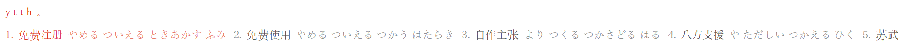

# rime-kunyomi

Input Chinese words by Japanese Kunyomi with Rime | Rimeとともに中国語単語を日本語訓読みで入力

## Features

(1) Input Chinese by kunyomi

(2) Input Jukujikun

(3) Reverse lookup kunyomi by Chinese pinyin

(4) Other features like acronym and Simplified Chinese

## Acknowledgements

* [熟字訓・当て字索引](https://www.kanjipedia.jp/sakuin/jyukujikun_ateji/%E3%81%82) - Data source of Jukujikun (Date: 20181007)
* [旧字体・新字体変換](http://www.geocities.jp/qjitai/) - Convert Jukujikun to Kyūjitai for consistency in data file
* [漢字辞典オンライン](https://kanji.jitenon.jp/) - Data source of single characters

## Similar Projects

* [rime-hanja](https://github.com/sgalal/rime-hanja): Input Chinese words by Korean pronunciation
