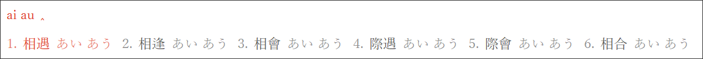
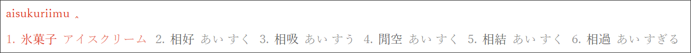
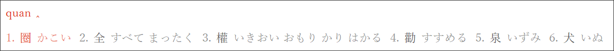

# rime-kunyomi

日本語訓読みをRimeで入力

This schema uses OpenCC to convert the characters to Japanese style. Please put `JPVariants.txt` and `t2jp.json` in the `opencc` folder in advance.

(1) Input Chinese by kunyomi

(2) Input Jukujikun

(3) Reverse lookup kunyomi by Chinese pinyin

Acknowledgements:

* 熟字訓 - From https://www.kanjipedia.jp/sakuin/jyukujikun_ateji/%E3%81%82 (Date: 20181007)
* 旧字体・新字体変換 http://www.geocities.jp/qjitai/
* Single character - From https://kanji.jitenon.jp/
* JPVariants.txt - From mrhso https://github.com/mrhso/OpenCC/blob/dictionary/data/dictionary/JPVariants.txt
